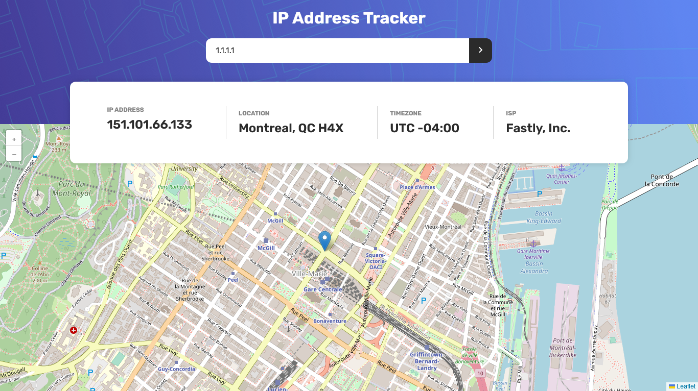

# Frontend Mentor - IP address tracker solution

This is a solution to the [IP address tracker challenge on Frontend Mentor](https://www.frontendmentor.io/challenges/ip-address-tracker-I8-0yYAH0). Frontend Mentor challenges help you improve your coding skills by building realistic projects. 

## Table of contents

- [Frontend Mentor - IP address tracker solution](#frontend-mentor---ip-address-tracker-solution)
  - [Table of contents](#table-of-contents)
  - [Overview](#overview)
    - [The challenge](#the-challenge)
    - [Screenshot](#screenshot)
      - [Desktop](#desktop)
      - [Mobile](#mobile)
    - [Links](#links)
    - [Built with](#built-with)
    - [What I learned](#what-i-learned)
    - [Continued development](#continued-development)
    - [Useful resources](#useful-resources)
  - [Author](#author)


## Overview

### The challenge

Users should be able to:

- View the optimal layout for each page depending on their device's screen size
- See hover states for all interactive elements on the page
- See their own IP address on the map on the initial page load
- Search for any IP addresses or domains and see the key information and location

### Screenshot

#### Desktop

#### Mobile


### Links

- Solution URL: [IP Address tracker typscript](https://github.com/daydy225/ip-tracker-typeScript)
- Live Site URL: [IP-address-tracker-225.netlify.app](ip-address-tracker-225.netlify.app)


### Built with

- Mobile-first workflow
- [React](https://reactjs.org/) - JS library
- [TypeScript](https://www.typescriptlang.org/) - For types
- [React-leaflet](https://react-leaflet.js.org/) - For map
- [Leaflet](https://leafletjs.com/) - For map
- [IP Geolocation API by IPify](https://geo.ipify.org/) - For IP address
- [Google Dns](https://dns.google/resolve?name=${domainName}) _ For domain name into IP address
- [fetch API](https://developer.mozilla.org/en-US/docs/Web/API/Fetch_API) - For fetching data
- [API API ](http://ip-api.com/json/${ipAddress}) - For IP address into location data
- [React-Icons](https://react-icons.github.io/react-icons/) - For icons
- [React context API](https://reactjs.org/docs/context.html) - For state management
- [Styled Components](https://styled-components.com/) - For styles


### What I learned

In this challenge I learned a lot about  react, how to fetch data using fetch api, style component for styling, the use of custom hooks to write react hooks in the same function to avoid boilerplate code.
I learned how to use react-leaflet and leaflet to display map and marker on the map.
Use react context api in typescript to manage state, use google dns to convert domain name into IP address, also IP Geolocation API by IPify to get IP and get location data from IP.
On top of that I feel more comfortable with typescript and I'm able to use it in my future projects.
The last but not the least is a function to get timezone offset from string like 'Australia/sydney' to a string 'UTC +00:00' and convert all abbreviation time in their corresponfing format int UTC.


To see how some code snippets you could keep, see below:


```ts
// the custom hook to get IP address and location data

import { useCallback, useEffect, useState } from "react";
import { LocationData } from "../types";
 
//  location data type
export interface LocationData {
  status: string;
  country?: string;
  countryCode?: string;
  region?: string;
  regionName?: string;
  city?: string;
  zip?: string;
  lat?: number;
  lon?: number;
  timezone?: string;
  isp?: string;
  query?: string;
}


export const useGeolocation = (ip?:string) => {
    const [ipAddress, setIpAddress] = useState('');
    const [locationData, setLocationData] = useState<LocationData | null>(null);


   
  //  get ip address if not provided
    const getIpAddress = useCallback(async () => {
      try {
        
        const res = await fetch('https://api.ipify.org?format=json');
        const data = await res.json();
        setIpAddress(data.ip);
      } catch (error) {
        throw new Error('Failed to get IP address');
      }
    }, [ip]);

  //  convert  domain name to ip address
  const convertToIpAddress = useCallback(async (domainName: string) => {
    try {
      const res = await fetch(`https://dns.google/resolve?name=${domainName}`);
      const data = await res.json();

      if (data.Status === 0 && data.Answer && data.Answer.length > 0) {
        return data.Answer[0].data;
      }

      throw new Error('Failed to convert domain name to IP address');
    } catch (error) {
      throw new Error('Failed to convert domain name to IP address');
    }
  }, []);

  
    //  get location data from ip address
    const getIpLocationData = useCallback(async () => {
      try {
        const targetIp = ip || ipAddress;
        const finalIp = targetIp && targetIp.split('.').length !== 4 ? await convertToIpAddress(targetIp) : targetIp;

        if (finalIp) {
          const res = await fetch(`http://ip-api.com/json/${targetIp}?fields=58367`);
        const data = await res.json();
        setLocationData(data);
        }
      } catch (error) {
        console.log('error', error);
        throw new Error('Failed to get IP location data');
      }
    }, [ip, ipAddress, convertToIpAddress]);
  
    useEffect(() => {
      getIpAddress();
    }, [getIpAddress]);
  
    useEffect(() => {
      getIpLocationData();
    }, [getIpLocationData]);
  
    return { ipAddress, locationData };
  };


```

```ts
// the function to get timezone offset from string like 'Australia/sydney' to a string 'UTC +00:00' and convert all abbreviation time in their corresponfing format int UTC.

import { abbreviationTimeObj } from "./abbreviation_time_obj";

// get timezone UTC +OO from string like Australia/Sydney
export const getOffset = (timezone: string) => {
    const now = new Date();
    const offset = now.toLocaleTimeString('en', { timeZone: timezone, timeZoneName: 'short' }).split(' ')[2];
    const utcOffset = abbreviationTimeObj[offset];

  if (utcOffset) {
    return `UTC ${utcOffset}`;
  } else {
    console.log(offset);
    return `UTC ${offset}`;
  }
  };
```

```ts
export const abbreviationTimeObj:Record<string, string> =  {
        ACST: '+09:30',
        ACT: '-05:00',
        ADT: '-03:00',
        AEDT: '+11:00',
        AEST: '+10:00',
        AFT: '+04:30',
        AKDT: '-08:00',
        AKST: '-09:00',
        ALMT: '+06:00',
        AMST: '+05:00',
        AMT: '+04:00',
        ART: '-03:00',
        AST: '-04:00',
        AWST: '+08:00',
        AZOST: '+00:00',
        AZOT: '-01:00',
        AZT: '+04:00',
        BDT: '+08:00',
        BIOT: '+06:00',
        BIT: '-12:00',
        BOT: '-04:00',
        BRST: '-02:00',
        BRT: '-03:00',
        BST: '+01:00',
        BTT: '+06:00',
        CAT: '+02:00',
        CCT: '+06:30',
        CDT: '-05:00',
        CEST: '+02:00',
        CET: '+01:00',
        CHADT: '+13:45',
        CHAST: '+12:45',
        CHOT: '+08:00',
        CHOST: '+09:00',
        CHST: '+10:00',
        CHUT: '+10:00',
        CIST: '-08:00',
        CIT: '+08:00',
        CKT: '-10:00',
        CLST: '-03:00',
        CLT: '-04:00',
        COST: '-04:00',
        COT: '-05:00',
        CST: '-06:00',
        CT: '+08:00',
        CVT: '-01:00',
        CWST: '+08:45',
        CXT: '+07:00',
        DAVT: '+07:00',
        DDUT: '+10:00',
        DFT: '+01:00',
        EASST: '-05:00',
        EAST: '-06:00',
        EAT: '+03:00',
        ECT: '-04:00',
        EDT: '-04:00',
        EEST: '+03:00',
        EET: '+02:00',
        EGST: '+00:00',
        EGT: '-01:00',
        EIT: '+09:00',
        EST: '-05:00',
        ET: '-04:00',
        FET: '+03:00',
        FJT: '+12:00',
        FKST: '-03:00',
        FKT: '-04:00',
        FNT: '-02:00',
        GALT: '-06:00',
        GAMT: '-09:00',
        GET: '+04:00',
        GFT: '-03:00',
        GILT: '+12:00',
        GMT: '+00:00',
        GST: '+04:00',
        GYT: '-04:00',
        HDT: '-09:00',
        HAEC: '+02:00',
        HST: '-10:00',
        HKT: '+08:00',
        HMT: '+05:00',
        HOVST: '+08:00',
        HOVT: '+07:00',
        ICT: '+07:00',
        IDT: '+03:00',
        IOT: '+03:00',
        IRDT: '+04:30',
        IRKT: '+08:00',
        IRST: '+03:30',
        IST: '+05:30',
        JST: '+09:00',
        KALT: '+02:00',
        KGT: '+06:00',
        KOST: '+11:00',
        KRAT: '+07:00',
        KST: '+09:00',
        LHST: '+10:30',
        LINT: '+14:00',
        MAGT: '+12:00',
        MART: '-09:30',
        MAWT: '+05:00',
        MDT: '-06:00',
        MET: '+01:00',
        MEST: '+02:00',
        MHT: '+12:00',
        MIST: '+11:00',
        MIT: '-09:30',
        MMT: '+06:30',
        MSK: '+03:00',
        MST: '-07:00',
        MUT: '+04:00',
        MVT: '+05:00',
        MYT: '+08:00',
        NCT: '+11:00',
        NDT: '-02:30',
        NFT: '+11:00',
        NPT: '+05:45',
        NST: '-03:30',
        NT: '-03:30',
        NUT: '-11:00',
        NZDT: '+13:00',
        NZST: '+12:00',
        OMST: '+06:00',
        ORAT: '+05:00',
        PDT: '-07:00',
        PET: '-05:00',
        PETT: '+12:00',
        PGT: '+10:00',
        PHOT: '+13:00',
        PHT: '+08:00',
        PKT: '+05:00',
        PMDT: '-02:00',
        PMST: '-03:00',
        PONT: '+11:00',
        PST: '-08:00',
        PT: '-07:00',
        PWT: '+09:00',
        PYST: '-03:00',
        PYT: '-04:00',
        RET: '+04:00',
        ROTT: '-03:00',
        SAKT: '+11:00',
        SAMT: '+04:00',
        SAST: '+02:00',
        SBT: '+11:00',
        SCT: '+04:00',
        SDT: '-10:00',
        SGT: '+08:00',
        SRET: '+11:00',
        SRT: '-03:00',
        SST: '-11:00',
        SYOT: '+03:00',
        TAHT: '-10:00',
        TFT: '+05:00',
        TJT: '+05:00',
        TKT: '+13:00',
        TLT: '+09:00',
        TMT: '+05:00',
        TOT: '+13:00',
        TRT: '+03:00',
        TST: '+14:00',
        TTT: '+11:00',
        TVT: '+12:00',
        UCT: '+00:00',
        ULAT: '+08:00',
        UTC: '+00:00',
        UYST: '-02:00',
        UYT: '-03:00',
        UZT: '+05:00',
        VET: '-04:00',
        VLAT: '+10:00',
        VOLT: '+04:00',
        VOST: '+06:00',
        VUT: '+11:00',
        WAKT: '+12:00',
        WAST: '+02:00',
        WAT: '+01:00',
        WEST: '+01:00',
        WET: '+00:00',
        WIT: '+07:00',
        WST: '+08:00',
        YAKT: '+09:00',
        YEKT: '+05:00',
}
```

### Continued development

I want to continue to work on the styling of the page in  react using sytled component.
I want to learn react hook like useReducer and useContext to manage the state of the app, useCallback, useMemo to memoized data in the application.

### Useful resources

- [React Dev](https://react.dev/) - This helped me to learn more about react hooks and I totally  recommand to use it to learn react instead of watching tutorials.

## Author

- Website - [Dabely Dadi](https://github.com/daydy225)
- Frontend Mentor - [@daydy225](https://www.frontendmentor.io/profile/daydy225)


